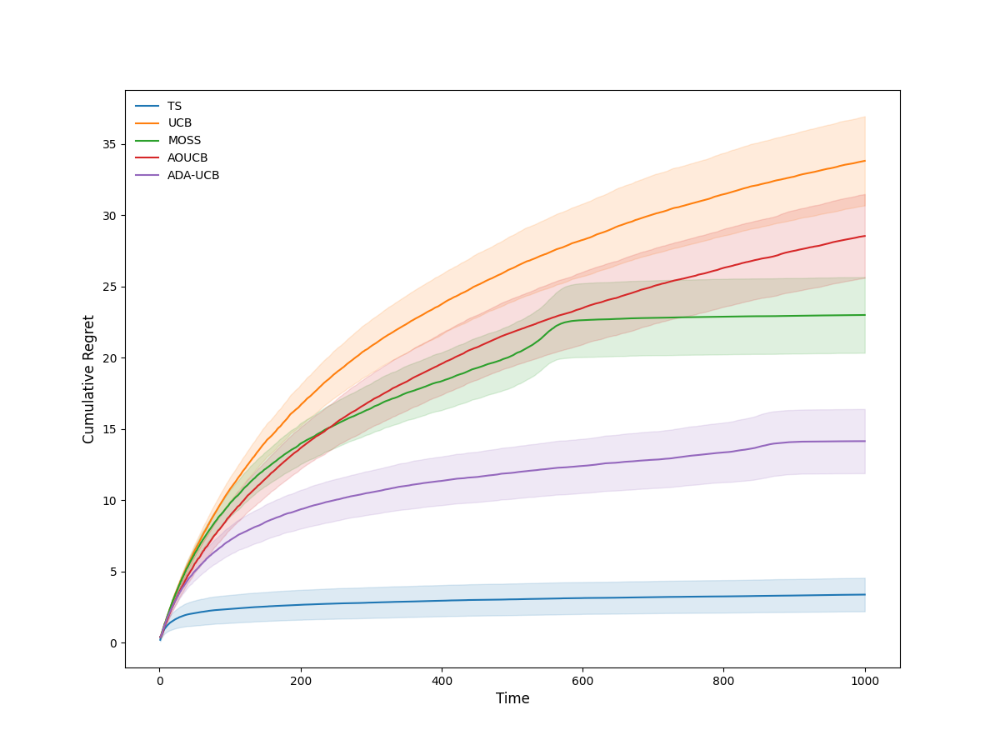

# Bandits
The Bandits package is an easy-to-use framework for testing and comparing various bandit algorithms. Currently, the package implements numerous provably efficient algorithms for the problem, and more are to come! The Bernoulli environment included is a simple benchmark that allows one to experiment with the algorithms and investigate their performance. However, defining a custom environment is easy; see the environment class template in the final section!

## Algorithms
Currently, the package implements the following algorithms:
* ```agents.ucb.UCB1(sample, nactions)``` (classic upper confidence bound algorithm)
* ```agents.ucb.MOSS(sample, nactions)``` (minimax optimial in the stochastic case algorithm) 
* ```agents.ucb.AOUCB(sample, nactions)``` (asymptotically optimal upper confidence bound algorithm)
* ```agents.ucb.ADA(sample, nactions)``` (adaptive upper confidence bound algorithm)
* ```agents.ts.BTS(sample, nactions)``` (Thompson sampling algorithm for Bernoulli bandits)
* ```agents.eg.EG(sample, nactions, epsilon)``` (epsilon-greedy algorithm)


# Problem Setting
Consider entering a casino. In front of you are five slot machines. You want to leave the casino with as much money as possible. It follows that you would like to find which of the five slot machines, on average, gives the highest reward.

<p align="center">
  
</p>

However, you have no information about any of the slot machines. How do you find the one with the highest expected reward while losing the least amount of money in the process? This problem is what bandit algorithms attempt to solve. 

# Using Bandits
## Sample Function
To define the bandit, all you need is a function that samples a reward for each action. 

Below is an example of a simple environment with two actions whose expected rewards are equal to 0.5 and 0.8:

```python
def sample(time, action): 
  '''
  Parameters
  ----------
  time (int) - time of action
  action (int) - selection of the agent
  
  Output
  ------
  feedback (dict): {'time': [], 'action': [], 'reward': []}
  '''
  if action == 1: 
    r = np.random.binomial(1, 0.5, 1)[0]
    feedback = {'time': [time], 'action': [action], 'reward': [r]}
  elif action == 2: 
    r = np.random.binomial(1, 0.8, 1)[0]
    feedback = {'time': [time], 'action': [action], 'reward': [r]}
  else: 
    # code to raise errors upon selection an invalid action
    raise ValueError('Error: only two available actions')
```

## Agents
Once there is a function for sampling rewards, it is easy to set up and run the bandit algorithm. All you need is the following lines of code:
```python
import agents.ucb as ucb

# setup the standard upper confidence bound algorithm to select one-hundred actions
agent = ucb.UCB1(sample = sample, nactions = 2)

# let the agent interact with the environment by selecting one-hundred actions
history = agent.run(nsamples = 100, reset = False)
```
The variable ```history``` is a dictionary containing the ordered sequence of actions and the corresponding rewards. Also, ```history``` is a class variable, meaning you can access it via: ```agent.history```

# Experiments

## Bernoulli Bandit Experiment
Included is a standard benchmark environment for testing multi-armed bandit algorithms. Consider the example above; an environment with two actions whose reward distributions are: Bernoulli(0.5) and Bernoulli(0.8), respectively. 

We can compare various algorithms using the ```experiment()``` function.
```python
import agents.eg as eg
import agents.ts as ts
import agents.ucb as ucb

from experiments import *
from environments.bernoulli import *

nsamples = 1000
niterations = 500

parameters = {1: 0.5, 2: 0.8}
expectations = {1: 0.5, 2: 0.8}

environment = Bernoulli(parameters, expectations)

learners = {
    'TS': ts.BTS(sample = environment.sample, nactions = 2),
    'UCB': ucb.UCB1(sample = environment.sample, nactions = 2),
    'MOSS': ucb.MOSS(sample = environment.sample, nactions = 2),
    'AOUCB': ucb.AOUCB(sample = environment.sample, nactions = 2), 
    'ADA-UCB': ucb.ADA(sample = environment.sample, nactions = 2)}

results = experiment(learners, nsamples, niterations, environment)

plot(results, width = 0.5)

```

<p align="center">
  
</p>


## Custom Experiments
If you would like to run simulations using your own environment and make use of: ```experiment()```  and ```plot()```, you must create a class using the following template:

```python
class Custom:
  def __init__(self, parameters, expectations): 
    '''
    Parameters
    ----------
    parameters (dict) - {1: kwargs, ..., K: kwargs}
    expectations (dict) - {1: mean, ..., K: mean}
    '''
    self.parameters = parameters
    self.expectations = expectations
    
  def samples(self, time, action): 
    '''
    Parameters
    ----------
    time (int) - time of action
    action (int) - selection of the agent
    
    Output
    ------
    feedback (dict): {'time': [], 'action': [], 'reward': []}
    '''
    pass
```
We refer the user to the ```environments.py``` file of this repository for the Bernoulli bandit environment implementation using the above template. Inclusion of the parameter ```time``` is necessary and allows for more complex feedback structures, such as: time-dependencies and delays. 


